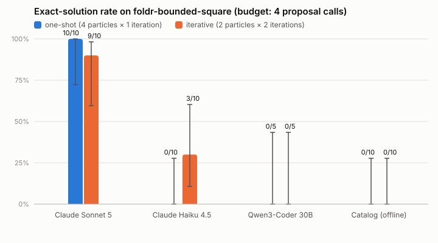
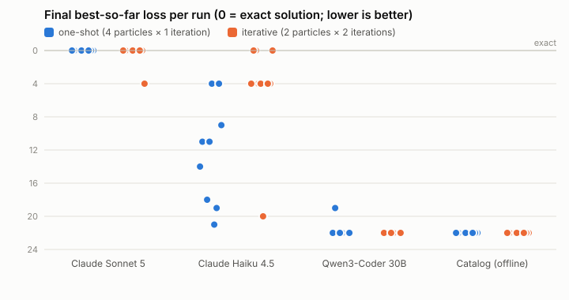
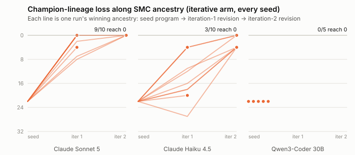
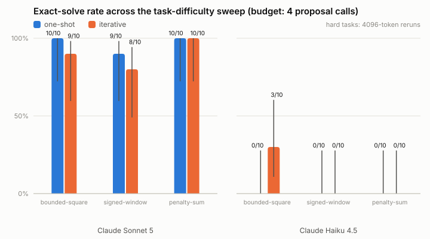
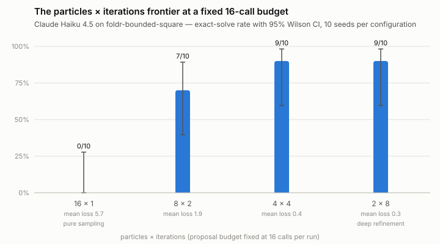

# Capability Gates, Refinement Depth Unlocks: LLM Proposers in Verified Sequential-Monte-Carlo Program Synthesis

*A reproducible empirical study on the verified-SMC programming-by-example prototype (ModelSMC, Paper 1; typed PBE, Paper 2). Experiments run 2026-08-04; every quantitative claim below was verified against raw traces by an independent multi-agent audit.*

## Abstract

We study when sequential-Monte-Carlo (SMC) refinement helps large-language-model (LLM) program synthesis inside a formally verified evaluator. A candidate program is one SMC particle; a Dafny/LemmaScript-verified core type-checks and runs it; a soft edit-distance loss plus a structural cost penalty form the SMC potential. Across three experiments (270 runs, four proposers, three tasks, two proposal budgets) we find a clean separation of roles. **Proposer capability is a hard gate**: a small quantized local model (Qwen3-Coder 30B) mode-collapses and never leaves the trivial seed, and no search compensates. **In the one above-gate cell we sweep to depth, refinement depth — not population width — converts budget into solutions**: at a fixed 16-call budget, Claude Haiku 4.5 solves the bounded-square task 0/10 with pure sampling (16×1) but 9/10 with deep refinement (2×8 or 4×4), Fisher $p = 1.2\times10^{-4}$. At the frontier (Claude Sonnet 5) search strategy is irrelevant — the model solves one-shot. We also document two methodological hazards that masquerade as search-strategy effects — call attrition from token truncation, and multiple-comparison exposure — and we show the verified core's role is precisely to make the SMC potential a well-defined total function (Proposition 1). We conclude that verified SMC turns a mid-tier model into a reliable synthesizer at a budget where naïve sampling fails, provided the model clears a capability floor.

## 1. Introduction

LLM-guided program synthesis increasingly wraps a language model in a search loop. ModelSMC (Paper 1) casts that loop as sequential Monte Carlo over executable programs; typed programming-by-example (Paper 2) supplies the specification and a verified semantics. This prototype fuses the two: an offline catalog or a (local or cloud) LLM proposes complete typed ASTs, a machine-checked core evaluates them, and an SMC shell weights and resamples the population. A single earlier run suggested "iterative feedback beats one-shot," but a single run is an anecdote. We ask, at increasing rigor:

- **RQ1.** At equal proposal budget, does ancestry-aware iterative SMC refinement beat independent one-shot sampling?
- **RQ2.** How does the answer depend on proposer capability and on task difficulty?
- **RQ3.** What work does the verified boundary do during search — empirically, and formally?
- **RQ4.** Given a larger budget, how should it be split between population width (particles) and refinement depth (iterations)?

**Contributions.**
1. A capability-conditional answer to RQ1: three empirical regimes (§4), with mechanistic trace-level explanations (§5).
2. A budget-frontier result (RQ4, §7): in the one above-gate model-task cell we sweep to depth, refinement depth — not population width — converts a fixed budget into solutions (0/10 → 9/10). Whether this holds across other cells is left open (§8).
3. Two negative methodological findings (§6): a token-budget call-attrition confound, and the multiple-comparison fragility of small synthesis matrices.
4. A precise statement of the verified core's role (§3): it makes the SMC potential a total, well-typed function (Proposition 1, machine-checked), the minimum for the Feynman–Kac construction to be defined.
5. A fully scripted, re-runnable harness and an adversarially audited results record.

## 2. Preliminaries: the Feynman–Kac potential

We follow the SMC formulation of ModelSMC. A *particle* is a complete executable program $m \in \mathcal{M}$; a population of $P$ particles is propagated over $T$ iterations by a transition kernel $M_t$ (here an LLM proposer conditioned on a particle's ancestor and its scored failures) and reweighted by a **potential function**

$$
G_t : \mathcal{X}_{t-1}\times\mathcal{X}_t \to [0,\infty),
$$

a supplied nonnegative score that need not be a normalized probability. With initial distribution $\mu$, the kernels and potentials define an unnormalized path measure and its normalized target,

$$
\widetilde p_t(x_{0:t}) = \mu(x_0)\prod_{i=1}^{t} M_i(x_i\mid x_{i-1})\,G_i(x_{i-1},x_i),
\qquad
p_t = \widetilde p_t / Z_t ,
$$

and weights update multiplicatively, $\widetilde w_t^{(i)} = w_{t-1}^{(i)}\,G_t(x_{t-1}^{(i)},x_t^{(i)})$, normalized to $w_t^{(i)}$ for resampling. SMC thereby approximates *the normalized distribution induced by* $(\mu,\{M_t\},\{G_t\})$: it evaluates a supplied potential but does not learn it. In ModelSMC the potential is a surrogate likelihood $G_k(m_k)\approx \widehat p(x_o\mid m_k)$ estimated by simulation.

## 3. The verified core makes the potential well-defined

For programming-by-example over a fixed dataset $\{(x_j,y_j)\}_{j=1}^{n}$, this prototype instantiates the potential as

$$
\log G(m) \;=\; -\lambda \sum_{j=1}^{n} d\!\left(m(x_j), y_j\right) \;-\; \beta\,\mathrm{cost}(m),
\qquad G(m)=\exp\log G(m)\in[0,\infty),
$$

with $d$ a bounded type-aware distance (§4.3) and $\mathrm{cost}$ a structural size penalty (an Occam prior).

Computing $G(m)$ *runs the candidate program*, $m(x_j)$. For $G$ to be the total nonnegative function the Feynman–Kac construction assumes, evaluation must terminate, never crash, and return a value of the type $d(\cdot, y_j)$ expects. An LLM-proposed AST has none of these guarantees a priori. The verified core supplies exactly them on the type-checker's accepted set $\mathcal{M}_{\text{typed}}$.

> **Proposition 1 (Potential well-definedness; machine-checked).** For every program $m$ the verifier accepts and every input of the declared type, evaluation succeeds and yields a value of the inferred output type. Hence $G : \mathcal{M}_{\text{typed}} \to [0,\infty)$ is total and well-typed.
>
> *Proof.* This is the type-soundness theorem `EvaluateProgramSound` in [`language.verify.dfy`](../src/core/language.verify.dfy): under `valueMatchesType(input, inputType)` and `inferType(program, inputType).TypeOk?` it `ensures evaluate(program, input).EvalOk?` (progress — no evaluation error) and `valueMatchesType(evaluate(program,input).output, inferType(...).inferred)` (preservation — the output inhabits the inferred type). The DSL has no unbounded recursion (no `Fix`, no general application), so evaluation is total by structural recursion on the finite input list. $\square$

> **Proposition 2 (Well-founded cost prior; machine-checked).** $\mathrm{cost}$ is positive and strictly decreasing along the subterm order, so the cost cap admits only finitely many programs and the Occam term is well-founded.
>
> *Proof.* `expressionCost_ensures` gives $\mathrm{cost}(m)\ge 1$; `ExpressionBodyCostExceedsDirectChildren` and `ProgramCostExceedsContainedBodies` give $\mathrm{cost}(\text{parent}) > \mathrm{cost}(\text{child})$ for every *compound* constructor (every branching expression node, and the `map`/`foldr` wrappers). Leaf expressions have cost 1, and the `expression`-program wrapper is the identity on cost; the subterm order is thus well-founded and bounded below, so a fixed cap admits finitely many programs. $\square$

The exactness metric is likewise anchored in the verified evaluator: a program *solves* the task iff `matchesExample` holds on every example, and the lemma `MatchesExampleExact` proves this is exactly "evaluation succeeds and the value equals the target." **Every "exact" count in this report is therefore a verified statement, not a heuristic match.**

**Consequence for the search.** $\mathcal{M}_{\text{typed}}$ is precisely the support on which the potential is defined; each verifier rejection is a point where $G$ would otherwise be undefined (a crash, a type error, or an over-budget program outside the prior's support). On any rejection or proposer failure the engine retains the particle's ancestor, keeping every particle on this well-defined support for the whole run.

> **Scope of the theory.** This prototype is a *Feynman–Kac-inspired search*, not a calibrated Feynman–Kac model. The shell applies no importance correction for the unknown LLM proposal density and re-scores a fixed dataset rather than accumulating incremental potentials, so the classical asymptotic SMC guarantees — convergence of the particle approximation to $p_t$ and unbiasedness of the $Z_t$ estimate as $P\to\infty$ — do **not** transfer. What the theory licenses is the qualitative role of resampling (weight-proportional reallocation of descendants toward high-potential regions), whose empirical bite Experiment 3 measures. Verification makes the potential well-formed; it does not make the population a correct posterior. This is the exact sense of "a verified core inside an approximate shell."

The later `grammar-smc` control in the prototype addresses this issue only for a separately declared finite AST universe with a known grammar prior and incremental tempering potentials. It is not used in E1–E3 and does not retroactively calibrate their black-box LLM populations.

## 4. Method

**4.1 Language.** A defunctionalized higher-order combinator DSL over `Int`, `Bool`, `List<Int>`, `List<Bool>`, with program families `expression`, `map`, and `foldr`; 17 expression constructors; scoped `Item`/`Accumulator`; no unrestricted recursion.

**4.2 Deduction.** Before sampling, family hypotheses are inferred and refuted from the examples (e.g. `map` is refuted when list lengths differ); a `foldr` empty-list example fixes the initial accumulator and observed suffixes induce reducer subexamples. These hints are unverified search guidance; every complete candidate is still checked by the verified evaluator.

**4.3 Loss.** $d$ is capped absolute distance for integers, 0/1 for Booleans, and a bounded sequence edit distance for lists (insertion/deletion cost 1; substitution the scalar loss capped at 2), so a shifted-but-useful list is not penalized as if every later element changed.

**4.4 SMC loop.** Each iteration (1) computes effective sample size from the normalized weights; (2) resamples ancestors when relative ESS falls below threshold; (3) clones an ancestor or asks the proposer for a complete program; (4) decodes, type-checks, and evaluates it; (5) renormalizes. A best-so-far champion archive retains any exact discovery even if resampling later drops it.

## 5. Experiment 1 — Capability regimes at a 4-call budget

**Task.** `foldr-bounded-square`: from 14 examples over `List<Int>`, discover `λxs. foldr (λitem. λacc. if (-2 < item && item < 3) then (item*item :: acc) else acc) [] xs` — keep elements in $(-2,3)$, square them, preserve order. Composing three ideas (fold, two-sided predicate, arithmetic transform) under a cost cap of 30 that rejects memorize-the-examples enumerations.

**Design.** Two arms at **exactly 4 proposal calls**: *one-shot* (4 particles × 1 iteration, no feedback) and *iterative* (2 particles × 2 iterations, relative-ESS threshold 1, round 2 revising round-1 survivors with loss-ranked failure feedback). Proposers: Claude Sonnet 5, Claude Haiku 4.5 (Anthropic Messages API, forced tool-use, temperature omitted); Qwen3-Coder 30B (`qwen3-coder:30b-a3b-q8_0`, local Ollama, strict JSON-schema decoding); and the deterministic offline catalog. 10 SMC seeds per cell (5 for the local model). Primary metric: verified exact solution within budget; secondary: final best-so-far loss (0 = exact) and first-exact call.



| Proposer | one-shot | iterative | Fisher $p$ (success) | mean final loss one-shot → iterative | permutation $p$ (loss) |
|---|---|---|---|---|---|
| Claude Sonnet 5 | **10/10** | **9/10** | 1.00 | 0.0 → 0.4 | 1.00 |
| Claude Haiku 4.5 | 0/10 | **3/10** | 0.21 | 12.2 → **4.4** | **0.011** |
| Qwen3-Coder 30B | 0/5 | 0/5 | 1.00 | 21.4 → 22.0 | 1.00 |
| Catalog (offline) | 0/10 | 0/10 | 1.00 | 22.0 → 22.0 | 1.00 |

*Wilson 95% CIs are whiskers in the figure. Fisher: two-sided exact test on exact-solve counts. Permutation: exact two-sided test on mean final loss (all C(20,10) = 184,756 partitions; C(10,5) = 252 for Qwen). Eight tests are reported here; the haiku loss difference is the only one clearing $\alpha=0.05$, and its uncorrected $p = 0.011$ does not survive a Bonferroni correction across the eight ($\approx 0.088$). We read it as suggestive, backed by the mechanistic trace evidence below — and, decisively, by Experiment 3.*



The answer to RQ1 is **conditional on capability**. Three regimes are visible; §7 later shows the *boundaries* of these regimes move with the proposal budget, so read the regime labels as budget-4 snapshots, not fixed model properties.

**Regime 1 — Above threshold, feedback is unnecessary (Sonnet 5).** Sonnet solves from a standing start in essentially every run (10/10 one-shot, median first exact at call 2; 9/10 iterative). The arms are indistinguishable ($p=1.0$); the point estimate is even consistent with iteration slightly *hurting* at ceiling, since the iterative arm gets only 2 independent first draws and a wrong cycle-1 hypothesis consumes both repair calls (the anatomy of the single sonnet miss, §5.2). Either way, a frontier proposer makes search strategy irrelevant at this difficulty.

**Regime 2 — Near threshold, feedback shifts the loss distribution (Haiku 4.5).** Haiku one-shot never solves the task (0/10; median loss 11, spread 4–21). Iterative refinement at the same budget reaches exactness in 3/10 runs and moves the bulk of the loss distribution to $\le 4$ (9/10 runs, vs 2/10 one-shot): mean final loss 12.2 → 4.4 (permutation $p=0.011$ uncorrected; success difference not significant, Fisher $p=0.21$). The mechanism is not fail-safe — one iterative run (seed 5) lost two of four calls to rejections and finished at loss 20. Merely beating the seed does not discriminate the arms (every haiku one-shot run also beats it); the difference is in *how far below* the seed runs land.

**Regime 3 — Below threshold, feedback did not rescue (Qwen3-Coder 30B, catalog).** In 9 of 10 Qwen runs the final champion is still the loss-22 empty-list seed (best run: loss 19); the catalog is identically stuck. With 5 seeds per arm the intervals are wide (Wilson upper bound 43%), so the claim is *did not rescue here*, not *cannot* — but §5.3's forensics give a mechanistic reason to expect more seeds to behave the same.



### 5.1 Haiku's near-misses are one bug, and feedback fixes it

All six loss-4 iterative champions share one defect: lower bound `-1 < item` instead of `-2 < item`, silently dropping `item = -1` (whose square, 1, appears in 4 of 14 outputs — exactly loss 4). The `{0,1,2}` keep-range is deceptive: $0^2=0$, $1^2=1$, so identity looks correct on most kept values. The exact/near-miss split is decided by cycle 2. In solved runs the mechanism is legible in the model's own rationale — seed 3's second cycle reads the failing-example list and states *"examples 3, 12, 13, and 14 show that Item=-1 should produce 1 (since -1 × -1 = 1)… adjusting the condition to -2 < Item"* — emitting the target exactly (loss 4 → 0). One-shot haiku stops where iterative cycle 1 stops: of its two loss-4 runs, one lands on this canonical near-miss, and with no second cycle the boundary is never repaired.

### 5.2 Sonnet's single miss: a wrong hypothesis plus two wasted repair calls

The one sonnet iterative failure (seed 3) locked onto a plausible-but-wrong piecewise rule in cycle 1 — *negate negatives, map 2 → 4, drop ≥ 3* (loss 4) — never proposing `Multiply(item, item)`. Both cycle-2 repairs were lost to non-semantic causes: one envelope violation, and one cost-cap rejection at cost 31 caused by a redundant `&& true` padding the guard (a program semantically identical to its parent anyway).

### 5.3 Qwen's failure is mode collapse below the composition threshold

Qwen always picks the right *family* (`foldr` with initial `[]`) but never composes the three ideas: it **never proposes a two-sided conjunction** (only one-sided `item < 0` or per-value equality chains), **never proposes `item*item`** (misreading `[2] → [4]` as doubling and `[-1] → [1]` as negation), and misuses the accumulator, returning `[]` instead of `acc` to "drop" an item (truncating everything folded so far). Its modal proposal scores loss 24, *worse than the loss-22 seed*. Most striking is **mode collapse**: 23 of its 28 accepted proposals are byte-identical across seeds, arms, and feedback rounds — after "loss 22 → 24" feedback it re-proposes the same program verbatim. Its main alternative is a cost-53 memorization chain, rejected by the cost cap in 9 of 10 runs. Feedback has no purchase on a proposal distribution this collapsed (see the harness-parity caveat, §8).

### 5.4 The verified boundary's role (RQ3, empirical)

Across all 280 experiment-1 proposal calls, the verified boundary rejected **42 (15.0%)** before scoring (40 cost-cap, 2 type errors); another 8 (2.9%) failed upstream (envelope/decode/`max_tokens`).

| Proposer | requested | accepted | cost-cap rej. | type-error | envelope/API fail | accepted-but-worse |
|---|---|---|---|---|---|---|
| Claude Sonnet 5 | 80 | 53 | 21 | 0 | 6 | **0** |
| Claude Haiku 4.5 | 80 | 69 | 9 | 0 | 2 | 6 |
| Qwen3-Coder 30B | 40 | 28 | 10 | 2 | 0 | 24 |
| Catalog | 80 | 80 | 0 | 0 | 0 | 60 |

**First**, the cost cap does its Occam job: all ten of qwen's cost rejections are one byte-identical cost-53 chain; the Claude models' 30 cost rejections (cost 31–44) mix enumerations with near-correct *relational* programs pushed just over budget. **Second**, the *strongest* proposer is rejected the *most* by the boundary (cost + type: sonnet 26.25% of calls vs haiku 11.25%) — yet sonnet never once produced an accepted child worse than its parent (0/53; qwen 24/28); the verifier converts aggressive exploration into safe pressure. **Third**, scope violations were zero, and only two calls died at the decode stage — one haiku `Or` node the grammar lacks, one malformed-AST payload — so the forced tool-use schema almost entirely prevented the malformed-AST class, leaving types and cost as the active defenses. On every rejection the engine fell back to the ancestor; one sonnet run went exact despite losing 2 of 4 calls.

An expressiveness note: 16 of haiku's later `Or`-node attempts (§7) and several sonnet De Morgan rewrites like `!(item < -1) && !(2 < item)` show the DSL's lack of a disjunction constructor is a real, if minor, gap that models notice.

## 6. Experiment 2 — A task-difficulty sweep, and two methodological hazards

Experiment 1 could not measure feedback value at the frontier (sonnet one-shot 10/10). We added two harder tasks, each **validated before any API spend** by scoring the intended target with the verified evaluator (`experiments/validate-task.ts`): `foldr-signed-window` (list→list; negate in $(-3,0)$, square in $(-1,3)$, else drop; a planted deception where negation and squaring coincide at $x=-1$; target cost 28/32) and `foldr-window-penalty-sum` (list→scalar; add $x^2$ for $(-2,3)$, subtract $x$ for $x\ge 3$; accumulator arithmetic; target cost 21/30). Each task: {Sonnet 5, Haiku 4.5} × {one-shot, iterative} × 10 seeds, first at 2048 tokens and then **rerun at 4096** after a confound surfaced.



| Task (4096-token) | Sonnet one-shot | Sonnet iterative | Haiku one-shot | Haiku iterative | Haiku loss permutation |
|---|---|---|---|---|---|
| bounded-square | 10/10 | 9/10 | 0/10 | 3/10 | iterative better, $p=0.011$ |
| signed-window | 9/10 | 8/10 | 0/10 | 0/10 | n.s. (11.0 vs 9.5) |
| penalty-sum | 10/10 | 10/10 | 0/10 | 0/10 | **one-shot better, $p=0.011$** |

**Finding A — Token budget is a hidden difficulty knob (a call-attrition confound).** At 2048 tokens, harder tasks provoked long reasoning and call failures exploded: on penalty-sum, 38 of sonnet's 80 calls died (mostly `max_tokens` truncation), and an apparent ceiling-break (8/10) vanished at 4096 tokens (10/10 both arms). On signed-window at 2048, sonnet iterative dropped to 6/10 (Fisher $p=0.087$), and all four misses had the *identical* anatomy — two of four calls lost, stranding the lineage at a loss-4 near-miss; at 4096 the gap disappears (9/10 vs 8/10, $p=1.0$). **Iterative arms are structurally more fragile to lost calls** (a failed repair wastes a lineage step; a failed independent draw costs nothing), so arm comparisons are meaningless unless call-failure rates are reported alongside. Envelope violations, unlike truncations, persisted at 4096 (18 of sonnet's 19 signed-window failures; the 19th was a malformed-AST rejection) — a harness gap, not a token problem, since addressed (§8).

**Finding B — The B=4 feedback benefit is fragile and can reverse.** Haiku's two significant loss results at budget 4 point in *opposite directions*: iteration helps on bounded-square (12.2 → 4.4, $p=0.011$) but *hurts* on penalty-sum (38.0 vs 42.8, $p=0.011$ at 4096, replicating $p=0.003$ on the independent 2048-token set). The mechanism is the diversity cost of coupling: below threshold, revising a bad partial program is worth less than two more independent draws. At budget 4, the cell where feedback pays is a single one of six (haiku × bounded-square). *Experiment 3 shows this is largely a budget artifact within that cell — but see §8: we have no larger-budget data for the other five cells, so we make no cross-cell width claim.*

**Finding C — Difficulty is model-relative.** The two hard tasks order differently for the two models: signed-window is sonnet's hardest cell (9/10, 8/10 — the planted deception bites even at the frontier) while penalty-sum is trivial for it (median first exact: call 1); for haiku the reverse holds (penalty-sum median loss ≈ 40; signed-window ≈ 10). A one-dimensional difficulty axis does not exist; regime membership is a joint property of model and task.

## 7. Experiment 3 — The particles × iterations frontier

Both experiment-1 arms were corners of a tiny budget, and with two particles resampling can only copy one particle over the other — "iterative" was closer to greedy hill-climbing than to the paper's population mechanism. We fix the budget at **16 calls** and sweep the allocation for Haiku 4.5 on bounded-square (the cell known to engage at B=4): 16×1, 8×2, 4×4, 2×8; ten seeds each; 4096 tokens.



| Config | Exact | Mean loss | vs 16×1: Fisher / loss permutation |
|---|---|---|---|
| 16×1 (pure sampling) | 0/10 | 5.7 | — |
| 8×2 | 7/10 | 1.9 | $p=0.0031$ / $p=0.012$ |
| 4×4 | 9/10 | 0.4 | **$p=1.2\times10^{-4}$ / $p<10^{-4}$** |
| 2×8 (deep refinement) | 9/10 | 0.3 | **$p=1.2\times10^{-4}$ / $p<10^{-4}$** |

This is the study's most decisive contrast. The 4×4 and 2×8 comparisons against 16×1 survive Bonferroni correction across every test in the study (≈30 tests; $1.2\times10^{-4}\times30 \approx 0.0036$); the 8×2 comparison does not ($0.0031\times30\approx0.09$). Three conclusions, scoped to this one model-task cell:

1. **Within this cell, width cannot substitute for depth.** Haiku's per-call solve rate here is effectively zero — 16 independent draws produced 0 exact programs across 160 calls — yet refinement depth converts the same budget into a 90% solve rate. First-exact programs appear at calls 5–15: haiku needs *many* repair cycles, which is why the B=4 iterative arm (two cycles) reached only 3/10.
2. **The B=4 "narrow zone" was, in this cell, largely a budget artifact.** At B=4 the cell yielded 3/10; at B=16 it reaches near-ceiling on the same task. Where a proposer can use feedback at all, refinement depth is the operative variable — but this is demonstrated for one cell only (§8).
3. **The flat 4×4-vs-2×8 top suggests depth, not population width, is the binding factor here** — consistent with the paper's resampling mechanism having little room at these small populations. Separating population from depth effects needs larger budgets.

The capability gate remains firm and orthogonal: qwen's mode collapse (§5.3) would survive any depth. The revised one-line thesis: **capability gates whether search can succeed; refinement depth decides whether it does — demonstrated here for a single above-gate cell, and an open question for the rest (§8).**

## 8. Threats to validity

- **Single swept cell for the depth claim.** Experiment 3 deepened only haiku × bounded-square. We have no B=16 data for the other five E2 cells, and at B=4 penalty-sum showed iteration *hurting*. The §7 conclusion is therefore explicitly within-cell; it is not evidence that depth beats width for haiku × penalty-sum or × signed-window.
- **Task coverage and design circularity.** All three tasks use the single-combinator `foldr` family, and the two hard tasks were designed *after* the regime hypothesis, by the same investigators, informed by E1 forensics. They test predictions but are not an independent sample of task space.
- **Multiple comparisons.** ~30 tests were run across the study; only the E3 4×4/2×8 contrasts survive Bonferroni. The haiku B=4 loss result ($p=0.011$) does not, though it replicates in direction across two independent run sets. Treat every $p$ near 0.05 as suggestive pending pre-registered replication at larger N.
- **Small N.** 10 seeds per cell (5 for Qwen) gives wide Wilson intervals; qwen's 0/5 arms formally admit success rates up to 43%.
- **Harness non-parity.** Claude models propose via forced tool-use; qwen via Ollama strict-schema constrained decoding on a q8_0 quantized checkpoint. Constrained decoding is a known cause of repetitive output, so qwen's mode collapse may be partly a harness artifact.
- **LLM nondeterminism.** Claude 5 models ignore temperature; run-to-run variation from the model and from SMC seed effects on feedback routing are not separable here.
- **Feedback not ablated.** The iterative arm bundles resampling, loss-ranked feedback, sibling-avoidance, and champion retention; which component carries the effect is not isolated.
- **Envelope-decoder change is post-hoc and does not affect archived results.** After E1–E3 completed, the proposal decoder was hardened to tolerate benign tool-input variants (missing/null `rationale`), committed separately (`23b3db2`). Its commit *postdates* the E3 run, and all 40 E3 traces contain non-empty rationales and zero envelope-shape failures — so a strict decoder would have failed exactly the same (zero) E3 calls. **All three archived experiments are unaffected by this change**; E1/E2 traces confirm they ran under the strict decoder. The hardening only reduces attrition in *future* runs.

## 9. Related work

*ModelSMC* (Paper 1) frames scientific-model discovery as SMC over executable programs with likelihood-surrogate potentials; we borrow its potential/weight/resampling machinery and instantiate the potential for PBE. *Typed PBE* (Paper 2) contributes the typed specifications, family hypotheses, and verified semantics. *LLaMPPL / Feynman–Kac Transformers* apply the same SMC pattern to partial token strings rather than whole programs; our particles are complete typed ASTs, and our potential is exactly computable (via the verified evaluator) rather than estimated. Relative to LLM program-synthesis search that ranks samples heuristically, our contribution is to place the ranking inside a machine-checked potential (Proposition 1) and to measure, with adversarial verification, when the SMC loop around it actually pays.

## 10. Conclusion

Verified SMC turns a mid-tier LLM into a reliable program synthesizer at a budget where naïve sampling gets nothing (0/10 → 9/10 for Haiku at 16 calls), provided the model clears a capability floor no amount of search compensates for (Qwen). The verified core's role is precise and machine-checked: it makes the Feynman–Kac potential a total, well-typed function (Proposition 1), the minimum for the SMC construction to be defined. The two negative findings — call attrition masquerading as a search effect, and multiple-comparison fragility — are as important for practice as the positive one. **Capability gates; refinement depth unlocks — above the gate, and, so far, for the one cell we swept to depth.**

## 11. Reproducibility

All statistics come from the scripted pipeline; all $p$-values in this document are reproduced by the commands below (E3 requires `--baseline 16x1`). Qwen cells additionally require a local Ollama server with `qwen3-coder:30b-a3b-q8_0` pulled; pass `--skip-ollama` to run only the cloud cells.

```bash
# Experiment 1 (bounded-square, all proposers; needs Ollama for the qwen rows, or --skip-ollama)
ANTHROPIC_API_KEY=... npx tsx experiments/run-matrix.ts        # ~5 min; 160 cloud + 40 local calls

# Experiment 2 (hard tasks, deconfounded 4096-token reruns)
ANTHROPIC_API_KEY=... npx tsx experiments/run-matrix.ts \
  --task examples/foldr-signed-window.json --tag signed-window-4k \
  --proposers claude-sonnet-5,claude-haiku-4-5 --max-tokens 4096
ANTHROPIC_API_KEY=... npx tsx experiments/run-matrix.ts \
  --task examples/foldr-window-penalty-sum.json --tag penalty-sum-4k \
  --proposers claude-sonnet-5,claude-haiku-4-5 --max-tokens 4096

# Experiment 3 (particles x iterations frontier at budget 16)
ANTHROPIC_API_KEY=... npx tsx experiments/run-matrix.ts \
  --task examples/foldr-bounded-square.json --tag budget16-haiku \
  --proposers claude-haiku-4-5 --arms 16x1,8x2,4x4,2x8 --max-tokens 4096

# Analysis (writes results/stats*.json) and figures
npx tsx experiments/analyze.ts                                        # E1
npx tsx experiments/analyze.ts --summary results/summary-signed-window-4k.json
npx tsx experiments/analyze.ts --summary results/summary-penalty-sum-4k.json
npx tsx experiments/analyze.ts --summary results/summary-budget16-haiku.json --baseline 16x1
npx tsx experiments/validate-task.ts    # re-proves the new-task target programs exact and in-budget
npx tsx experiments/figures.ts && npx tsx experiments/figures-e2.ts && npx tsx experiments/figures-e3.ts
```

Raw JSONL traces land in `runs/experiments/` (gitignored, 270 files); parsed results and archived statistics in `experiments/results/summary*.json` and `stats*.json`. Total study: **270 runs** (E1 70, E2 160, E3 40).
